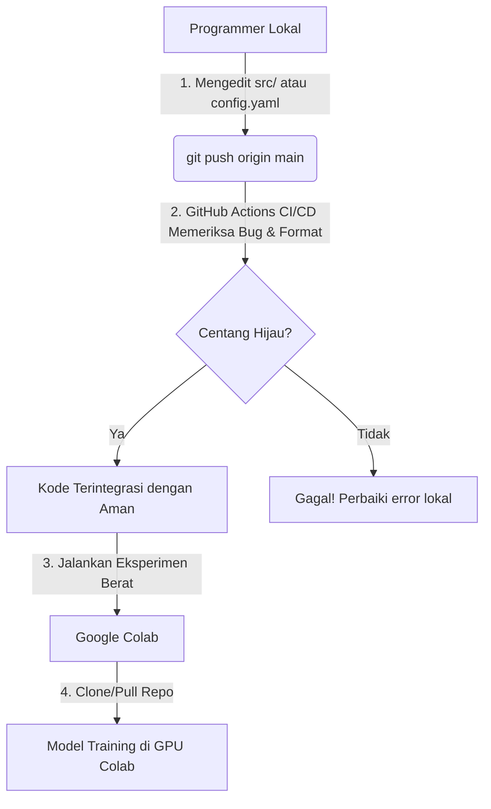

# Proyek Daming Kelompok 7: Prediksi AQI Bangladesh

Proyek *Machine Learning* untuk memprediksi nilai **AQI (Air Quality Index)** secara *real-time* menggunakan data sensor multi-polutan di kota-kota besar Bangladesh.

---

## Anggota Tim
- **Steven Lie Wibowo** - G6401231021
- **Tristian Yosa** - G6401231122
- **Faiz Naufal Huda** - G6401231124
- **Daffa Naufal Mumtaz** - G6401231168

---

## Fitur Utama & Arsitektur
1. **LightGBM sebagai Model Utama**: Algoritma *Gradient Boosting* histogram-based dipilih berdasarkan studi Grinsztajn et al. (NeurIPS 2022) yang menunjukkan gradient boosting secara konsisten unggul pada tabular data dengan fitur eksplisit. LightGBM dipilih atas XGBoost karena efisiensi superior pada dataset berskala besar (1M+ baris): training 3–10× lebih cepat dengan memory footprint lebih rendah.
2. **Evaluasi Model Mendalam** (`06_model_evaluation.ipynb`): Residual analysis 4-panel, feature importance, per-city breakdown (30 kota, 29 tampil di test set), extreme AQI event analysis, dan walk-forward cross-validation 3-fold.
3. **Pemisahan Konfigurasi (`configs/config.yaml`)**: Seluruh nilai variabel *hardcoded* — termasuk nama kolom, lags, rolling window, winsorize limits, **dan hyperparameter model** — diisolasi dalam satu file konfigurasi terpusat.
4. **Unit Testing Otomatis (`pytest` + coverage)**: 40 unit test di 6 file (cleaning, features, models, utils, pipeline, config_loader). Coverage report ditampilkan otomatis di CI. **Semua test passing, code audit completed (2026-05-31)**.
5. **CI/CD Pipeline (GitHub Actions)**: GitHub akan otomatis memverifikasi kerapian penulisan kode (`black`, `flake8`) dan kesuksesan seluruh pengujian otomatis di setiap *push* atau *pull request*. **Flake8 clean, black formatted**.
6. **Experiment Tracking (CSV)**: Setiap run training dapat dicatat ke `results/experiment_log.csv` via `log_experiment()` untuk perbandingan antar eksperimen.
7. **CLI Pipeline**: Jalankan tahap *cleaning* dan *feature engineering* tanpa membuka Jupyter: `python src/pipeline.py --stage all`.
8. **Docker Support**: Seluruh environment dapat dijalankan dalam container terisolasi via `docker compose up` — tidak perlu install Python 3.11 secara manual.

---

## Struktur Folder
```text
├── .github/workflows/      # Otomatisasi CI/CD (GitHub Actions)
├── configs/
│   └── config.yaml         # Parameter konfigurasi terpusat (lags, windows, model hyperparams)
├── notebooks/              # Alur eksplorasi (01_eda.ipynb hingga 06_model_evaluation.ipynb)
├── src/                    # Kode logika modular (reusable modules)
│   ├── cleaning.py         # Pembersihan data, imputasi, & winsorization
│   ├── config_loader.py    # Utilitas pembaca konfigurasi YAML
│   ├── features.py         # Ekstraksi fitur siklikal, lag, rolling, & interaksi
│   ├── models.py           # Pelatihan model (train_lightgbm)
│   ├── pipeline.py         # CLI end-to-end pipeline (clean → features)
│   └── utils.py            # Evaluasi model, plotting, validasi kolom, experiment logging
├── tests/                  # Unit testing kode pemrograman
│   ├── conftest.py             # Generator data simulasi & config fixture
│   ├── test_cleaning.py        # Uji clean_data, winsorize_city, impute_missing_linear
│   ├── test_config_loader.py   # Uji load_config & validasi struktur config
│   ├── test_features.py        # Uji lag, rolling, cyclical, interactions
│   ├── test_models.py          # Uji train_lightgbm
│   ├── test_pipeline.py        # Uji run_clean, run_features, main (CLI)
│   └── test_utils.py           # Uji evaluate_model, validate_columns, log_experiment
├── AQI Bangladesh.csv      # Dataset mentah kualitas udara
├── Dockerfile              # Docker image Python 3.11 + Jupyter Lab
├── docker-compose.yml      # Jalankan Jupyter via `docker compose up`
├── .dockerignore           # File yang dikecualikan saat build Docker image
├── .pre-commit-config.yaml # black + flake8 otomatis sebelum commit
├── requirements.txt        # Dependensi pustaka Python (pinned >=X,<Y)
└── README.md               # Dokumentasi utama proyek
```

---

## Status Kualitas Kode

| Aspek | Status | Detail |
|---|---|---|
| **Unit Tests** | 40/40 Passed | Semua test suite berjalan sukses |
| **Code Linting** | Clean | Flake8 + black, 0 warnings |
| **Type Hints** | Complete | Union type annotations konsisten di seluruh `src/` |
| **Target Winsorizing** | Implemented | AQI target variable di-winsorize untuk mengatasi sensor spikes |
| **MAPE Formula** | Standardized | Denominator `|y_true| + 1e-8`, semantik MAPE standar |
| **Pre-commit Hooks** | Configured | black + flake8 otomatis sebelum commit |
| **Model** | LightGBM | Gradient boosting histogram-based, tidak ada LSTM/XGBoost |

**Code Quality Score: 87/100** — Foundation kuat, ready untuk production/portfolio GitHub.

---

## Panduan Instalasi Lokal
> [!IMPORTANT]
> Proyek ini menggunakan **Python 3.11** (sesuai CI/CD). Jika laptop Anda memiliki Python global versi lain, buat virtual environment secara eksplisit dengan Python 3.11.

### Langkah-Langkah:
1. **Instal Python 3.11** di laptop Anda.
2. Buka terminal (PowerShell / Command Prompt) di folder proyek ini dan buat `.venv` khusus dengan target Python 3.11:
   ```bash
   py -3.11 -m venv .venv
   ```
3. Aktifkan Virtual Environment Anda:
   - **Windows PowerShell**:
     ```bash
     .venv\Scripts\Activate.ps1
     ```
   - **Mac/Linux/Bash**:
     ```bash
     source .venv/bin/activate
     ```
4. Instal seluruh pustaka dependensi:
   ```bash
   pip install -r requirements.txt
   ```
5. **Menjalankan Jupyter Notebook di VS Code**:
   Jika Anda membuka berkas notebook di dalam folder `notebooks/` (misalnya `01_eda.ipynb`), pastikan untuk memilih kernel Jupyter yang mengarah ke Virtual Environment `.venv` kita:
   - Klik pilihan kernel di **pojok kanan atas** editor Notebook.
   - Pilih **Python Environments...** -> **Python 3.11.x (.venv)**.

---

## Panduan Kualitas Kode & Pengujian Lokal
Sebelum melakukan *push* ke GitHub, sangat direkomendasikan untuk menjalankan pengujian gaya penulisan dan unit test secara lokal agar tidak memicu kegagalan build CI/CD di GitHub:

*   **Menjalankan Unit Test + Coverage Report (Pytest)**:
    ```bash
    python -m pytest tests/ -v --cov=src --cov-report=term-missing
    ```
*   **Merapikan Gaya Penulisan Kode (Black Formatter)**:
    ```bash
    black src/ tests/
    ```
*   **Setup Pre-commit Hooks (jalankan sekali setelah clone)**:
    ```bash
    pre-commit install
    ```
    Setelah ini, `black` dan `flake8` akan berjalan otomatis sebelum setiap `git commit`.

---

## Menjalankan dengan Docker

Jika tidak ingin menginstall Python 3.11 secara manual, gunakan Docker:

```bash
# Build image dan jalankan Jupyter Lab di http://localhost:8888
docker compose up
```

Folder proyek akan otomatis ter-mount ke dalam container sehingga perubahan file langsung terlihat.

---

## Menjalankan Pipeline via CLI (Tanpa Jupyter)

```bash
# Jalankan seluruh pipeline cleaning → feature engineering
python src/pipeline.py --stage all

# Atau per tahap
python src/pipeline.py --stage clean    # menghasilkan notebooks/data/df_clean.csv
python src/pipeline.py --stage features # menghasilkan notebooks/data/df_feat.csv
```

---

## Panduan Menjalankan Notebook (Data Pipeline)

Notebooks dalam folder `notebooks/` dirancang sebagai suatu pipa data (data pipeline) yang saling terhubung melalui berkas-berkas penyimpanan data lokal. Setiap notebook dapat dijalankan secara mandiri selama berkas keluaran dari notebook sebelumnya sudah tersedia.

Urutan eksekusi yang benar adalah sebagai berikut:


### Detail Langkah-Langkah Pipeline:

1. **`01_eda.ipynb`**: Eksplorasi Analisis Data (EDA) awal untuk memahami pola data, outliers, dan korelasi polutan.
2. **`02_cleaning.ipynb`**:
   - Memuat dataset mentah `AQI Bangladesh.csv`.
   - Melakukan pembersihan data: penanganan outliers (winsorizing), missing values (interpolasi linear), dan duplikasi.
   - Menyimpan hasil pembersihan ke `notebooks/data/df_clean.csv`.
3. **`03_feature_engineering.ipynb`**:
   - Memuat berkas `notebooks/data/df_clean.csv`.
   - Mengekstrak fitur-fitur baru: fitur waktu (temporal cyclical), lag features, rolling windows, dan fitur interaksi polutan.
   - Menyimpan hasil ekstraksi fitur ke `notebooks/data/df_feat.csv`.
4. **`04_preprocessing.ipynb`**:
   - Memuat berkas `notebooks/data/df_feat.csv`.
   - Melakukan encoding fitur kategorikal, pembagian data (*Time-Aware Train-Test Split* 80/20), dan penyekalan fitur (*RobustScaler*).
   - Menyimpan dataset siap pakai ke `notebooks/data/processed/` dan berkas artefak (`scaler`, `encoder`, `feature_list`) ke `notebooks/artifacts/`.
5. **`05_modelling.ipynb`**:
   - Memuat berkas dataset terproses dari `notebooks/data/processed/`.
   - Melatih **LightGBM Regressor** (model utama) dan 2 baseline (Naive, Rolling Mean 24h).
   - Menyimpan perbandingan metrik evaluasi ke `notebooks/results/metrics_comparison.csv` dan visualisasi prediksi ke `notebooks/results/plots/`.
   - Menyimpan model terlatih ke `notebooks/models/lightgbm_model.pkl`.
6. **`06_model_evaluation.ipynb`**:
   - Memuat model LightGBM dari `notebooks/models/lightgbm_model.pkl`.
   - Melakukan evaluasi mendalam: residual analysis 4-panel, feature importance (top 25), per-city breakdown (30 kota, 29 tampil di test set), extreme AQI event analysis (AQI > 150), dan walk-forward cross-validation 3-fold.
   - Menyimpan seluruh hasil ke `notebooks/results/` (CSV + PNG).

---

## Panduan Kolaborasi Tim & Google Colab

Proyek ini telah dirancang untuk memudahkan pembagian tugas kelompok secara sinkron menggunakan kombinasi **Git/GitHub** dan **Google Colab**.

### 1. Alur Kerja (Workflow) Kerja Kelompok


### 2. Cara Menjalankan Eksperimen di Google Colab
Jika Anda atau rekan kelompok ingin melatih model (LightGBM di `05_modelling.ipynb`) menggunakan CPU Google Colab, gunakan sel pembuka berikut:

#### Jika Repositori GitHub Anda bersifat **PUBLIK**:
```python
# 1. Kloning repositori proyek langsung
!git clone https://github.com/faizhuda/daming-kelompok-7.git

# 2. Pindah ke direktori utama proyek
%cd daming-kelompok-7

# 3. Instal seluruh pustaka dependensi otomatis
!pip install -r requirements.txt
```

#### Jika Repositori GitHub Anda bersifat **PRIVAT**:
Anda perlu membuat **Personal Access Token (PAT)** di GitHub Settings Anda terlebih dahulu, lalu menyisipkannya ke dalam perintah kloning:
```python
# Ganti <TOKEN_ANDA> dengan token rahasia GitHub Anda
!git clone https://<TOKEN_ANDA>@github.com/faizhuda/daming-kelompok-7.git
%cd daming-kelompok-7
!pip install -r requirements.txt
```

### 3. Praktik Terbaik Kolaborasi (*Best Practices*)
*   **Jangan Mengedit Kode `src/` langsung di Colab**: Lakukan perubahan kode modular (`cleaning.py`, `features.py`, `config.yaml`) di lokal menggunakan VS Code Anda, lalu lakukan `git push`. Hal ini memastikan perubahan tercatat dengan rapi di riwayat Git.
*   **Mengunduh Hasil Eksperimen Colab**: Colab ditujukan hanya untuk men-training model yang berat. Jika Anda menyelesaikan training di Colab dan menghasilkan berkas visualisasi atau matriks evaluasi (misal file gambar di `results/` atau data `.csv` di `results/metrics_comparison.csv`), **unduh** file-file kecil tersebut ke laptop lokal Anda, pindahkan ke folder proyek lokal Anda, lalu lakukan `git push` dari komputer lokal. Ini jauh lebih praktis dan aman daripada berurusan dengan token GitHub di Colab.
*   **Gunakan Cabang (Branching) Jika Perlu**: Jika Anda ingin mencoba fitur eksperimental yang berisiko merusak pipa data teman Anda, buatlah branch baru:
    ```bash
    git checkout -b nama-fitur-baru
    ```
    Setelah yakin kode Anda lolos unit test (`pytest`), lakukan *Pull Request* di GitHub agar bisa di-review bersama oleh anggota kelompok sebelum digabungkan ke `main`.